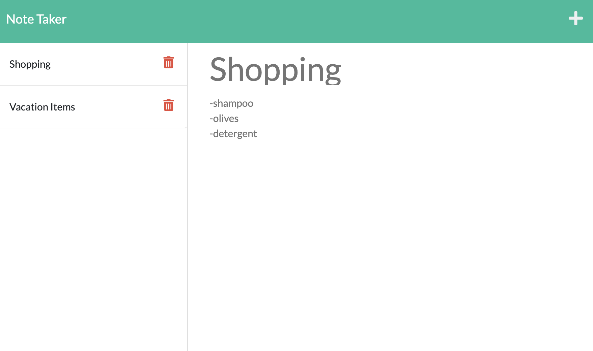

# Note Taker

## Application Description
This app can be used to write and save notes. Upon pressing 'Get Started' the user is taken to a page where they can write a title and note. Then they can press the save icon to save the not to the lefthand panel and access it later by clicking it there.

## Challenge Description
It uses an Express.js back end and saves and retrieves note data from a JSON file. The challenge required the server.js file to be written to connect the backend and frontend. This was accomplished via requiring paths and node modules at the top, then using middleware, get requests, post requests, and port listening. It is deployed to Heroku.

## User Story

```
AS A small business owner
I WANT to be able to write and save notes
SO THAT I can organize my thoughts and keep track of tasks I need to complete
```

## Acceptance Criteria

```
GIVEN a note-taking application
WHEN I open the Note Taker
THEN I am presented with a landing page with a link to a notes page
WHEN I click on the link to the notes page
THEN I am presented with a page with existing notes listed in the left-hand column, plus empty fields to enter a new note title and the note’s text in the right-hand column
WHEN I enter a new note title and the note’s text
THEN a Save icon appears in the navigation at the top of the page
WHEN I click on the Save icon
THEN the new note I have entered is saved and appears in the left-hand column with the other existing notes
WHEN I click on an existing note in the list in the left-hand column
THEN that note appears in the right-hand column
WHEN I click on the Write icon in the navigation at the top of the page
THEN I am presented with empty fields to enter a new note title and the note’s text in the right-hand column
```

## Tasks Completed
The Server JavaScript document includes:
* Node Modules such as Express and File System
* Middleware, get requests, and post requests
* Ability to add new notes if a title and message is included
* Unique ID for each note is generated


## Languages
- JavaScript
- HTML
- CSS

## Links
* [Deployed Application](https://notetaker1919.herokuapp.com/)

* [Repository](https://github.com/villettec/M11C-Note_Taker)

## Screenshots



## Credit
Villette Comfort

villette@live.com